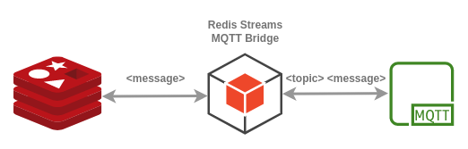

# Redis Streams Mqtt Bridge

Facilitates the connection between Redis streams and MQTT topics, allowing the seamless transmission of
bytes through reactive APIs. Both directions are supported, from Redis to MQTT and vice versa.
It enables efficient transmission of bytes between these two components, leveraging the power of Spring, the project
provides an intuitive way to manage this data flow.



## Features

- Connect Redis stream keys with MQTT topics.
- Send bytes seamlessly from Redis to MQTT using reactive APIs.
- Built on the Spring framework for easy integration and extensibility.

## Bridge Definitions

The configuration of this Spring project allows you to define a collection of `BridgeDefinitions`.
Each `BridgeDefinition` describes a connection between a redis stream key and a mqtt topic and the direction of the
flow.

### Bridge Definition Schema

The configuration follows the following schema:

```yaml
application:
  bridge-definitions:
    - name: <definition_name>
      direction: REDIS_TO_MQTT  # or MQTT_TO_REDIS
      streamKey: <the_redis_stream_key>
      topic: <the_mqtt_topic>
```

## Sample Usage

### Prerequisites

- Java 17
- Maven
- Redis Insights
- An Mqtt Client

1. Clone this repository: `git clone https://github.com/oalles/tb-gw-redis`
2. Navigate to the project directory: `cd redisxmqttbridge`
3. Run the redis instance: `docker-compose --file ../enviroment/docker-compose.yml up`
4. Set `application.properties` as:

```yaml
spring:
  data:
    redis:
      host: localhost
      port: 6379
mqtt:
  host: broker.hivemq.com
application:
  bridge-definitions:
    - name: sample
      direction: REDIS_TO_MQTT
      streamKey: input_stream_key
      topic: input_topic
```

5. Run the project using Maven: `mvn spring-boot:run`
6. Open an mqtt client, connect to `broker.hivemq.com` an subscribe to the topic: `input_topic`.
7. Open [RedisInsights](https://docs.redis.com/latest/ri/installing/install-redis-desktop/), connect to the DB, and
   run `XADD input_stream_key * a helloworld!` 
