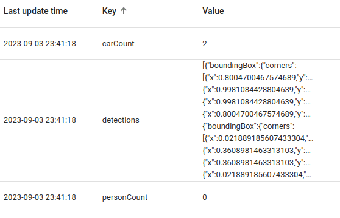

# Video Connector for Thingsboard

The `Video Connector for Thingsboard` is a Spring Boot and Apache Camel project that facilitates the integration of
video sources for real-time analytics within Thingsboard.

Based on the [Camel Video-IO Component](../camel-video-io/README.md), it integrates YOLO into our video processing
pipeline via [Deep Java Library](https://djl.ai/).
It performs real-time object detections on every frame of the video stream. This means that as each frame is processed,
the component can identify and locate objects of interest, such as persons and cars, providing valuable insights and
data for further analysis and transmission to Thingsboard.

## Getting Started

### Prerequisites

* Docker installed on your machine
* Java 17+
* Maven 3+ installed
* A running Thingsboard server or a [Thingsboard cloud](https://thingsboard.cloud/) account.

### Installation

1. Clone this repository: `git clone https://github.com/oalles/thingsboard-smartgw`
2. Navigate to the project directory: `thingsboard-smartgw/video-connector`
3. Build the project using Maven: `mvn clean install -DskipTests`
4. Configure the Video Connector in `application.properties`.

```yaml[video-connector/src/main/resources/application.yml]
video-connector:
  channel-name: "garage-cam" # A name for the channel, will be the device name in TB
  capture-address: "/thieves.webm" # The address of the video source to be streamed [http://8*.**.31.*9:80/mjpg/video.mjpg]
  analysis-quality: ULTRA_DEEP # Defaults to BALANCED
```

5. Run the Spring Boot application: `mvn spring-boot:run`.



## Code

### Camel Configuration

```java
 @Bean
public RouteBuilder routeBuilder(@Value("${video-connector.channel-name}") String channelName){
        return new RouteBuilder(){
@Override
public void configure(){
        from("video-io://{{video-connector.channel-name}}?captureAddress={{video-connector.capture-address}}&analysisQuality={{video-connector.analysis-quality}}")
        .bean("detectionService","detect")
        .bean("thingsboardClient","send")
        .routeId("video-detection-"+channelName);
        }
        };
        }
```

### Detection Service

Based on
the [Inference Service Configuration](./src/main/java/es/omarall/thingsboard/smartgw/connector/video/InferenceConfig.java),
the [Detection Service](./src/main/java/es/omarall/thingsboard/smartgw/connector/video/DetectionService.java) is
responsible for performing the object detection on each frame of the video stream.

```java

@Service
public class DetectionService {
    private final Predictor<Image, DetectedObjects> predictor;

    public DetectionService(final Supplier<Predictor<Image, DetectedObjects>> predictorSupplier) {
        this.predictor = predictorSupplier.get();
    }

    public DetectedObjects detect(BufferedImage image) {
        Image input = ImageFactory.getInstance().fromImage(image);
        try {
            return predictor.predict(input);
        } catch (TranslateException e) {
            throw new RuntimeException("Cannot be translated", e);
        }
    }
}
```